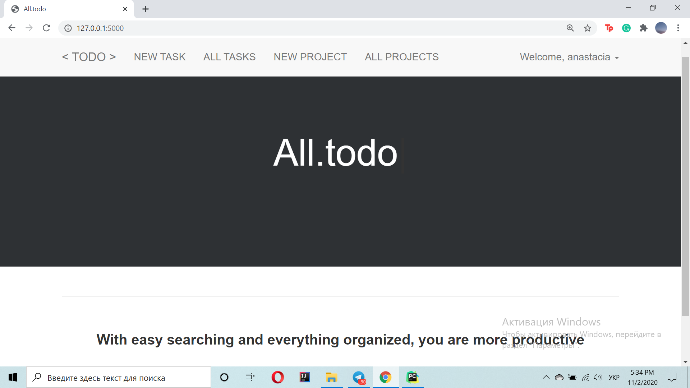
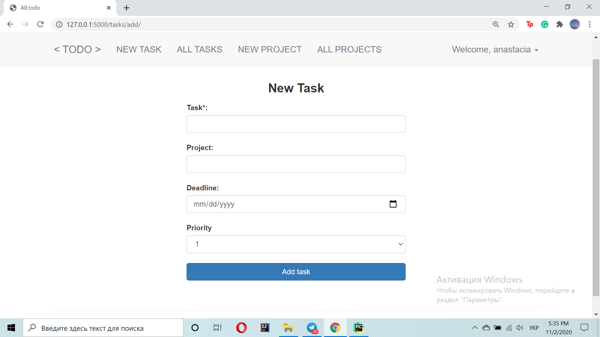
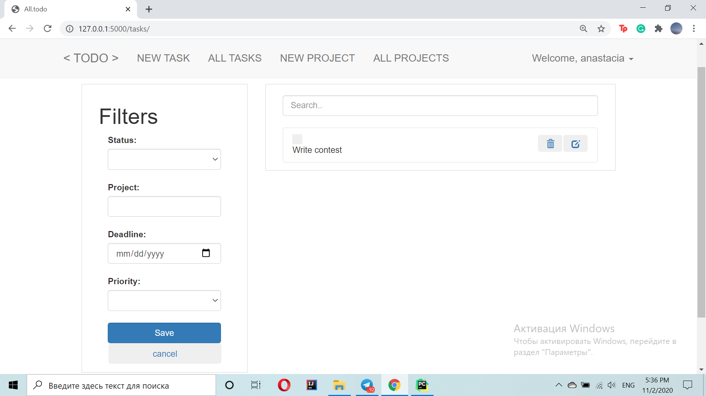
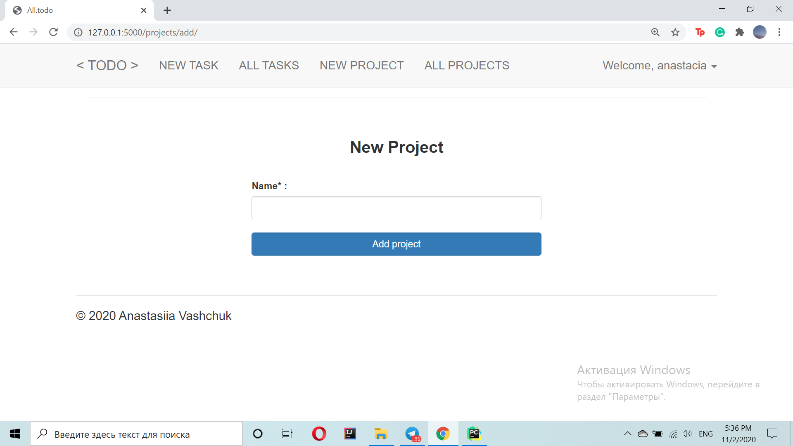
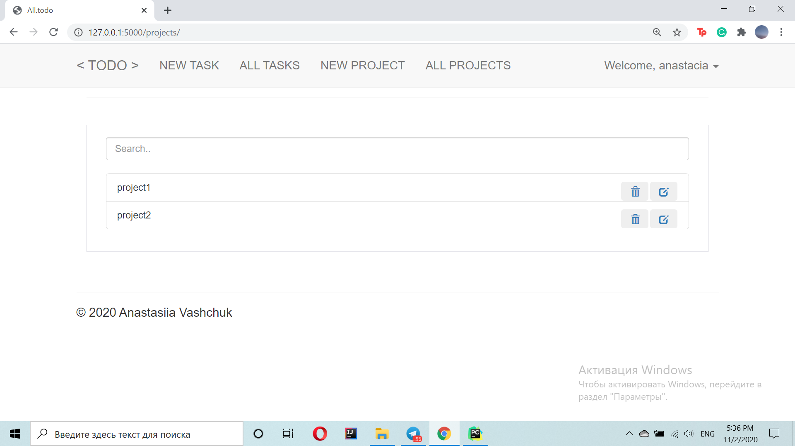
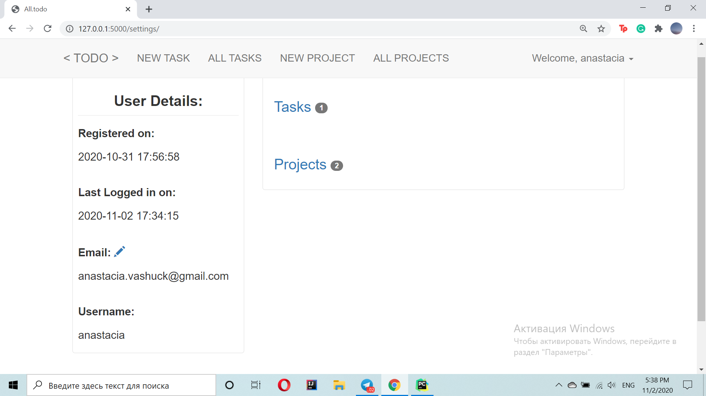

# Requirements:

Execute the following command to install the required third party libraries: 

`pip3 install -r requirements.txt`

# Usage:
Clone this repository:

`git clone https://github.com/`

Install the dependencies by simply executing:

`pip3 install -r requirements.txt`

Run this command to start the app:

`python3 manage.py`

Visit `0.0.0.0:5000` on your web browser

Built with ♥ by [`Anastasiia Vashchuk`](http://www.omkarpathak.in/)

# Results

## Homepage

## Create a new task

## View tasks 

## Add a project

## View all projects

## Profile Settings
Profile settings to see user details, change email and see tasks and projects saved by particular user

